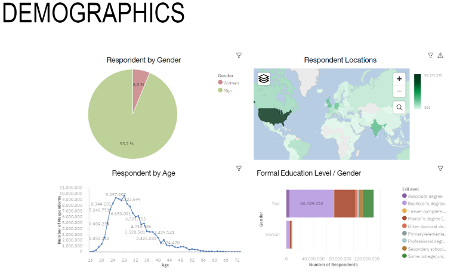

# IBM Data Analyst Professional Certificate — Capstone Project

**Course:** IBM Data Analyst Professional Certificate (Coursera)  
**Role:** Data Analyst (simulated industry scenario)  
**Deliverable:** End-to-end data analysis report with executive presentation

---

## Project Overview

In this capstone project, I took on the role of a Data Analyst for a global technology company. The objective was to identify **emerging technology trends and skills in demand** to help the HR and IT leadership make informed hiring and training decisions.

The analysis covered:
- Top programming languages currently in use and trending for the future
- Most in-demand database skills
- Popular IDEs among developers
- Developer demographics across regions and experience levels

---

## What I Did

| Stage | Details |
|---|---|
| Data collection | Gathered survey data from multiple sources including the Stack Overflow Developer Survey |
| Data wrangling | Cleaned, filtered, and prepared raw data for analysis |
| Exploratory data analysis | Identified distributions, outliers, and correlations in the dataset |
| Statistical analysis | Mined data for patterns in skills demand and technology adoption |
| Data visualisation | Created charts and plots to communicate findings clearly |
| Dashboard | Built an interactive dashboard using **IBM Cognos Analytics** |
| Presentation | Prepared an executive summary report for HR and IT stakeholders |

---

## Tools & Technologies

---

## Dashboard Previews

### Current Technology Usage

### Future Technology Trends

### Developer Demographics

---

## Key Findings

- **Python** and **JavaScript** dominate both current usage and future interest among developers
- **PostgreSQL** and **MySQL** remain the most in-demand database skills
- **VS Code** is the most widely used IDE across experience levels
- A significant skills gap exists between what developers currently use and what they plan to learn next year

---

## Project Presentation

The full analysis report and executive summary is available here:  
📄 [View Presentation (PDF)](./IBM%20Data%20analysis%20ppt.pdf)

---

## Certificate

This project was completed as the final capstone of the **IBM Data Analyst Professional Certificate** on Coursera.
